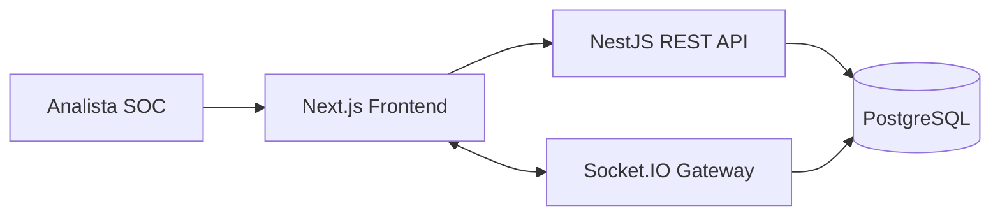

# SecOps Dashboard — Documentação Técnica

## 1. Visão geral

O SecOps Dashboard é uma plataforma web para operações de segurança (SOC) com backend NestJS, frontend Next.js e persistência em PostgreSQL. A aplicação centraliza eventos de segurança, vulnerabilidades, playbooks de resposta a incidentes, métricas operacionais, evidências de compliance e alertas em tempo real por WebSocket.

## 2. Arquitetura de alto nível



### Componentes

| Camada | Caminho | Responsabilidade |
| --- | --- | --- |
| Frontend | `frontend/` | Interface web, internacionalização, autenticação client-side e dashboards. |
| Backend | `backend/` | API REST, autenticação JWT, regras multi-tenant, persistência e WebSocket. |
| Banco de dados | `docker-compose.yml` | PostgreSQL local para desenvolvimento. |
| CI/CD | `.github/workflows/ci-cd.yml` | Quality gates, testes automatizados, builds e validação de deploy. |

## 3. Backend

### Stack

- NestJS 10
- TypeORM
- PostgreSQL
- JWT/Passport
- Socket.IO
- TypeScript

### Módulos principais

| Módulo | Responsabilidade |
| --- | --- |
| `auth` | Registro, login, emissão de JWT e proteção por strategy/guard. |
| `tenants` | Criação e isolamento lógico de organizações. |
| `security-events` | Eventos de segurança, filtros, estatísticas e gateway em tempo real. |
| `vulnerabilities` | Inventário e ciclo de vida de vulnerabilidades. |
| `incidents` | Gestão de incidentes de segurança. |
| `playbooks` | Runbooks e ações de resposta. |
| `metrics` | Métricas como MTTR, MTTD, timeline e distribuição por categoria. |
| `compliance` | Controles por framework, evidências e percentuais de aderência. |
| `audit` | Trilha de auditoria para ações sensíveis. |
| `notifications` | Notificações operacionais. |

### Configuração

Crie `backend/.env` a partir de `backend/.env.example` e ajuste as variáveis de conexão:

```bash
cd backend
cp .env.example .env
npm install
npm run start:dev
```

### Scripts relevantes

| Comando | Descrição |
| --- | --- |
| `npm run start:dev` | Inicia a API em modo watch. |
| `npm run build` | Compila o backend NestJS para `dist/`. |
| `npm run typecheck` | Valida tipos TypeScript sem emitir artefatos. |
| `npm test` | Compila o backend e executa testes automatizados com `node:test`. |
| `npm run test:ci` | Alias para execução em pipeline. |

## 4. Frontend

### Stack

- Next.js 14 App Router
- React 18
- Tailwind CSS
- next-intl
- Axios
- Recharts
- Socket.IO Client
- TypeScript

### Estrutura principal

| Caminho | Responsabilidade |
| --- | --- |
| `src/app/[locale]/` | Rotas internacionalizadas. |
| `src/app/[locale]/(dashboard)/` | Páginas autenticadas do dashboard SOC. |
| `src/components/` | Componentes de UI, layout e visualizações. |
| `src/lib/api.ts` | Cliente Axios e interceptors de autenticação. |
| `src/hooks/` | Hooks de tema, autenticação e WebSocket. |
| `messages/` | Catálogos de tradução (`en`, `pt-BR`, `es`). |

### Configuração

Crie `frontend/.env.local` a partir de `frontend/.env.example`:

```bash
cd frontend
cp .env.example .env.local
npm install
npm run dev
```

### Scripts relevantes

| Comando | Descrição |
| --- | --- |
| `npm run dev` | Inicia o Next.js localmente. |
| `npm run build` | Gera build de produção. |
| `npm run typecheck` | Valida tipos TypeScript. |
| `npm test` | Executa testes automatizados de mensagens/i18n com `node:test`. |
| `npm run test:ci` | Executa typecheck e testes automatizados. |

## 5. Testes automatizados

A suíte foi criada sem dependências adicionais, usando o test runner nativo do Node.js (`node:test`). Isso reduz custo de manutenção e evita acoplamento com frameworks de teste externos.

### Cobertura inicial

| Área | Arquivo | Validação |
| --- | --- | --- |
| Backend | `backend/test/metrics.service.test.js` | Agregação multi-tenant, cálculo de MTTR e agrupamento por categoria. |
| Frontend | `frontend/test/i18n-messages.test.mjs` | Paridade de chaves entre idiomas e preenchimento das traduções. |

### Execução local

```bash
cd backend && npm test
cd frontend && npm run test:ci
```

## 6. Pipeline CI/CD

O workflow `.github/workflows/ci-cd.yml` executa automaticamente em `push`, `pull_request` e execução manual (`workflow_dispatch`).

### Estágios

1. **Backend quality gate**
   - `npm ci`
   - `npm run typecheck`
   - `npm run test:ci`
2. **Frontend quality gate**
   - `npm ci`
   - `npm run test:ci`
   - `npm run build`
3. **Docker image build**
   - Build da imagem backend.
   - Build da imagem frontend.
4. **Deployment validation**
   - Em `main`/`master`, valida o arquivo `docker-compose.prod.yml` com `docker compose config`.

### Estratégia de deploy

O pipeline atual faz uma validação segura de deploy (dry-run). Para publicar imagens em registry ou implantar em ambiente real, adicione uma etapa protegida por secrets, por exemplo:

- `GHCR_TOKEN` ou permissões de GitHub Packages.
- `DEPLOY_HOST`, `DEPLOY_USER`, `DEPLOY_KEY` para SSH.
- Aprovações manuais via GitHub Environments.

## 7. Segurança e multi-tenancy

- O JWT carrega o `tenantId` do usuário autenticado.
- Serviços e consultas devem sempre filtrar dados pelo tenant.
- Credenciais devem permanecer em arquivos `.env` locais ou secrets do provedor de CI/CD.
- Não versionar tokens, dumps de banco ou evidências sensíveis.

## 8. Observabilidade operacional

Métricas expostas pela aplicação incluem:

- Total de eventos e eventos abertos.
- Total de vulnerabilidades e vulnerabilidades abertas.
- Score de compliance.
- MTTR e MTTD.
- Timeline de eventos.
- Incidentes por categoria.

## 9. Guia de contribuição

Antes de abrir um pull request:

```bash
cd backend && npm run test:ci
cd frontend && npm run test:ci
cd frontend && npm run build
```

Recomendações:

- Manter alterações pequenas e revisáveis.
- Adicionar testes para novas regras de negócio.
- Atualizar esta documentação quando mudar arquitetura, scripts, variáveis ou pipeline.
- Garantir que novas entidades respeitem o isolamento por `tenantId`.
